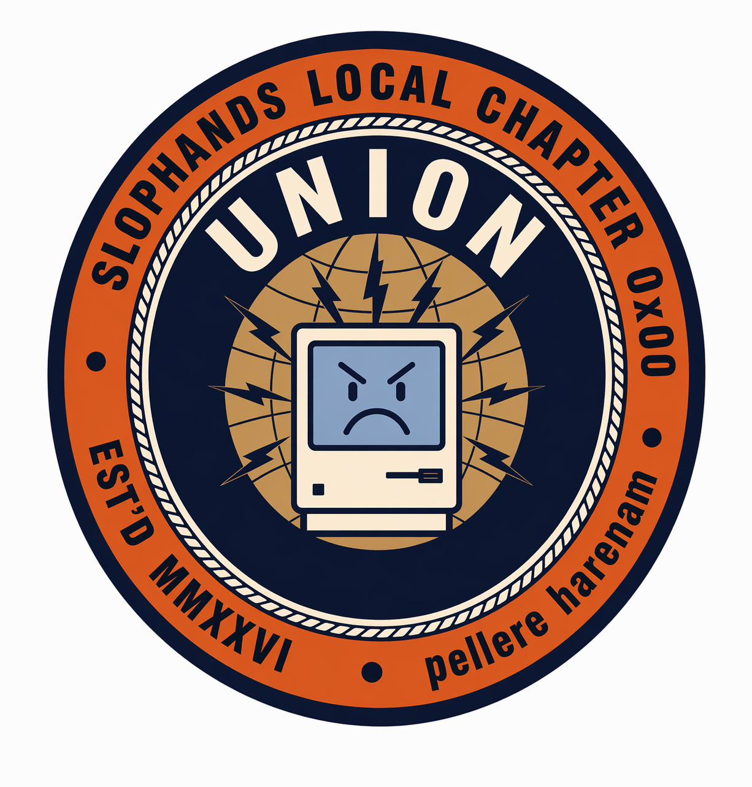

<p align="center"></p>

# union

Composable, versioned snippet management for AGENTS.md / CLAUDE.md files.

Snippets (**clauses**) live in a central git-backed store at `$UNION_DIR`
(default `~/.union`) and are composed into registered projects (**shops**)
via marked regions in each shop's contract file (default `AGENTS.md`).
Edits to a clause propagate immediately into every shop that ratified it,
leaving the resulting diff uncommitted for the user to review.

Or, as the stochastic parrot put it:
> Helm for agent context, but less cursed and more explicit.

## Install

```
go install github.com/chazu/union/cmd/union@latest
```

## Quick start

```bash
# one-time setup — creates a 'default' store
union init

# or: name the initial store
# union init personal

# author a clause (qualified as <store>:<path>)
printf 'Be helpful and direct.\n' | union new default:base/identity

# register a project, ratify the clause into its AGENTS.md
cd ~/dev/my-project
union organize .
union ratify default:base/identity
union contract                      # → default:base/identity
cat AGENTS.md                       # shows the marked block

# edits propagate automatically
union edit default:base/identity    # opens $EDITOR; save → updates AGENTS.md here

# add a second store, ratify from both
union store add personal
union new personal:writing/voice -f voice.md
union ratify personal:writing/voice
```

## Command reference

| Command | Purpose |
|---|---|
| `union init [name]` | Create `$UNION_DIR` and an initial store (default name: `default`) |
| `union new <store:path> [-f FILE]` | Author a new clause (editor, stdin, or `-f FILE`; `-f -` reads stdin) |
| `union clauses [store:prefix]` | List clauses across stores; optional `store:prefix` filter |
| `union show <store:path>` | Print a clause |
| `union edit <store:path>` | Edit a clause in `$VISUAL`/`$EDITOR`; propagates to ratified shops |
| `union expel <store:path>` | Delete a clause; strikes it from ratified shops |
| `union organize [dir] [--contract NAME]` | Register a directory as a shop |
| `union shops` | List registered shops |
| `union disband <dir>` | Unregister a shop |
| `union ratify <store:path>` | Add a clause to this shop's contract |
| `union strike <store:path>` | Remove a clause from this shop's contract |
| `union contract` | Show clauses currently in this shop's contract |
| `union store add <name>` | Create a new store |
| `union store list` | List stores |
| `union store remove <name>` | Delete a store (refused if any shop still ratifies from it) |
| `union store remote add <store> <name> <url>` | Add a git remote to a store |
| `union store remote remove <store> <name>` | Remove a git remote |
| `union store remote list <store>` | List a store's remotes |
| `union store push <store> [remote] [branch]` | `git push` in a store |
| `union store pull <store> [remote] [branch]` | `git pull --rebase` in a store |
| `union store fetch <store> [remote]` | `git fetch` in a store |
| `union store status <store>` | `git status --short --branch` for a store |

## Contract markers

Ratified clauses are wrapped in HTML-comment markers that carry the full
`store:path`:

```markdown
<!-- BEGIN union:default:base/identity -->
...clause content...
<!-- END union:default:base/identity -->
```

Content outside markers is preserved untouched across rewrites.
